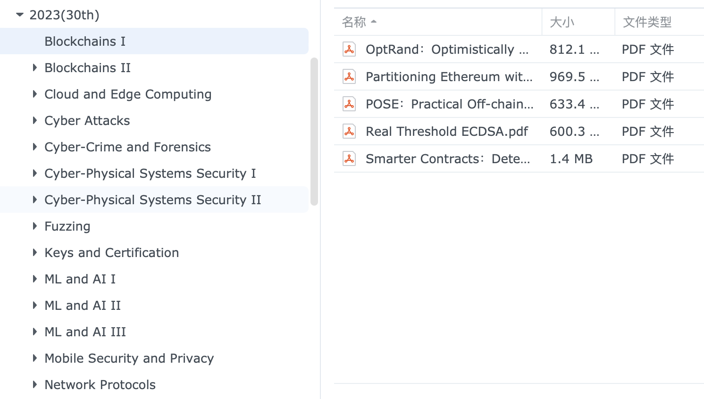

# 重要提示

1. 需要**订阅论文**后才能使用该工具，学校可能进行了订阅，此时连接校园网即可使用
2. 从 https://dblp.org 总结的论文开始爬取，需要从该网站中找到对应的会议，然后具体到年份，比如 https://dblp.uni-trier.de/db/conf/uss/uss2023.html

#   [USENIX Security](https://dblp.uni-trier.de/db/conf/uss/index.html)（&#x2713;）

## Use

`python usenix_security.py`，然后输入**会议地址**和**要保存的目录名称**


e.g.

```python
url: str = "https://dblp.uni-trier.de/db/conf/uss/uss2023.html"
parent_dir_name: str = "usenix_paper_2023"
```

效果：


## Details

### 1. 关键信息

#### （1）大标题

```html
<h2 id="secBreakingWirelessProtocols">Breaking Wireless Protocols</h2>
<h2 id="secInterpersonalAbuse">Interpersonal Abuse</h2>
```

正则表达：

```python
pattern = r'<h2 id="[^"]+">([^<]+)</h2>'
```

#### （2）论文题目

```html
<span class="title" itemprop="name">PhyAuth: Physical-Layer Message Authentication for ZigBee Networks.</span>
<span class="title" itemprop="name">Time for Change: How Clocks Break UWB Secure Ranging.</span>
```

正则表达：

```python
pattern = r'<span class="title" itemprop="name">([^<]+)</span>'
```

#### （3）论文地址

```html
<a href="https://www.usenix.org/conference/usenixsecurity23/presentation/li-ang" itemprop="url">
<a href="https://www.usenix.org/conference/usenixsecurity23/presentation/anliker" itemprop="url">
```

正则表达：

```python
pattern = r'<a\s+href="([^"]+)"\s+itemprop="url">'
```

### 2. 获取论文

```html
<meta name="citation_pdf_url" content="https://www.usenix.org/system/files/usenixsecurity23-dong-feng.pdf" />
```

正则表达：

```python
pattern = r'<meta\s+name="citation_pdf_url"\s+content="([^"]+)"\s*/>'
```

### 3. 遗漏

```python
err_papers: list = []

# 论文 pdf 地址不符合规范(正则表达式)
if len(pdf_urls) == 0:
		err_papers.append(paper_url)
		print(f"No paper URLs found for '{paper_url}'")
    
for err in err_papers:
    print(f"未成功下载论文地址: {err}")
```

#  [NDSS](https://dblp.uni-trier.de/db/conf/ndss/index.html)（&#x2713;）

## Use

`python ndss.py`，然后输入**会议地址**和**要保存的目录名称**


e.g.

```python
url: str = "https://dblp.uni-trier.de/db/conf/ndss/ndss2023.html"
parent_dir_name: str = "2023(30th)"
```

效果：



## Details

### 获取论文

> 其它部分均与 USENIX Security 一样，只有在官网获取论文的部分有所区别

```html
<a role="button" class="btn btn-light btn-sm pdf-button" target="_blank" href="https://www.ndss-symposium.org/wp-content/uploads/2023-289-paper.pdf">Paper</a>

<a role="button" class="btn btn-light btn-sm pdf-button" target="_blank" href="https://www.ndss-symposium.org/wp-content/uploads/2023-362-paper.pdf">Paper</a>
```

正则表达：

```python
pattern = r'href="(https?://.*?\.pdf)"'
```

#   [S&P](https://dblp.org/db/conf/sp/index.html)（&#x2713;）

> - S&P 本身是分类了的，但在官网却没有分类归纳，只能从《Table of Contents》中得知分类信息，所以这里直接爬取了论文，没有进行分类
> - 需要用于访问或下载内容的令牌或标记，以进行权限验证或跟踪目的，所以在拥有订阅权限的情况（IP）下需要对下载地址做出相应的修改
> 
>```html
> <iframe src="https://ieeexplore.ieee.org/stampPDF/getPDF.jsp?tp=&amp;arnumber=10179411&amp;ref=aHR0cHM6Ly9pZWVleHBsb3JlLmllZWUub3JnL2RvY3VtZW50LzEwMTc5NDEx" frameborder="0"></iframe>

## Use

`python s\&p.py`，然后输入**会议地址**和**要保存的目录名称**


e.g.

```python
url: str = "https://dblp.org/db/conf/sp/sp2023.html"
parent_dir_name: str = "2023(44th)"
```

> ⚠️ 实测发现存在未下载完整导致如下图所示 pdf 无法读取的情况，请求返回 200 因此也难以进行区分，此时**请删除错误格式的 pdf 后（预览查看更快）重新运行程序**，已下载的完整 pdf 会自动跳过不再重新下载以节省时间


效果：


## Details

### 获取论文

```html
"pdfUrl":"/stamp/stamp.jsp?tp=&arnumber=9833594"
```

即 https://ieeexplore.ieee.org/stamp/stamp.jsp?tp=&arnumber=9833594

但实际 https://ieeexplore.ieee.org/stampPDF/getPDF.jsp?tp=&arnumber=9833594&ref=aHR0cHM6Ly9pZWVleHBsb3JlLmllZWUub3JnL2RvY3VtZW50Lzk4MzM1OTQ%2FZGVuaWVkPQ%3D%3D

改成这种前缀即可，&ref= 后的内容需要等 stamp.jsp 响应才能获取

> ❓但实际发现不加 &ref= 的后缀也可以下载

正则表达：

```python
pattern: str = r'"pdfUrl":"\/stamp\/stamp\.jsp\?tp=&arnumber=(\d+)"'
```

补上前缀：

```python
def add_prefix_links(pdf_url: str) -> str:
    """
    '/stamp/stamp.jsp?tp=&arnumber=10179411'
    '/stamp/stamp.jsp?tp=&arnumber=10179343'
    正则提取的网址仅有后半段的 arnumber, 需要补全能获取论文的网址前缀

    :param pdf_url: 提取的网址
    :return: 补全前缀的网址
    """
    return "https://ieeexplore.ieee.org/stampPDF/getPDF.jsp?tp=&arnumber=" + pdf_url
```

# TODO

##  ACM（&cross;）

### Use

> ⚠️ 
>
> （1）ACM 无法简单爬虫 [ERROR] Failed to fetch webpage. Status code: 403, 此时 ACM 会封锁你的 IP: Your IP Address has been blocked, Please contact [dl-support@acm.org](mailto:dl-support@acm.org)
>
> （2）这是因为 ACM 启用了 Cloudflare 的 DDoS 保护页面, 所以使用了工具 `Selenium` 模拟浏览器的行为以获取网页源代码
>
> （3）尝试了无头模式, 但无法获取网页源代码, 所以程序运行过程中会调用 Chrome 浏览器（可通过修改代码选择使用的浏览器）
>
> （4）**可以爬取到 pdf 页面这一步, 却无法下载**, 其网页代码显示如下, 页面中的 `<embed>` 元素的 `src` 属性设置为 `about:blank`, 这意味着它本身不包含 PDF 文件的实际内容, 然而, 这个 `<embed>` 元素的 `name` 和 `internalid` 属性都设置为相同的值 `"3F177C14357E6DD8CC43D14A68765C3D"`, 这可能是一种引用或标识, 指示页面上的某个脚本或其他资源可以在运行时动态加载 PDF 内容并将其显示在 `<embed>` 元素中, 这种情况下, 页面的显示与 JavaScript 或其他前端脚本的操作有关: 当页面加载时, 脚本可能会根据某些条件或用户的交互行为来获取实际的 PDF 内容, 然后将其注入到 `<embed>` 元素中以显示出来, 即 **PDF 文件内容是从服务器端获取的，而不是在 HTML 页面中静态地包含的**
>
> ```html
> <embed name="3F177C14357E6DD8CC43D14A68765C3D" style="position:absolute; left: 0; top: 0;" width="100%" height="100%" src="about:blank" type="application/pdf" internalid="3F177C14357E6DD8CC43D14A68765C3D">
> ```

输入**会议地址**和**要保存的目录名称**

#### 1. [ACSAC](https://dblp.org/db/conf/acsac/index.html)

```python
url: str = "https://dblp.org/db/conf/acsac/acsac2022.html"
parent_dir_name: str = "2022(38th)"
```

#### 2. [RAID](https://dblp.org/db/conf/raid/index.html)

```python
url: str = "https://dblp.org/db/conf/raid/raid2022.html"
parent_dir_name: str = "2022(25th)"
```

### Details

#### 获取论文

```html
<a href="/doi/pdf/10.1145/3471621.3471854" title="PDF" target="_blank" class="btn red">
  
<a href="/doi/pdf/10.1145/3471621.3471841" title="PDF" target="_blank" class="btn red">
  
<a href="/doi/pdf/10.1145/3564625" title="PDF" class="btn red">
```

正则表达：

```python
pattern = r'<a\s+href="([^"]+)"\s+title="PDF"(?:\s+target="_blank")?\s+class="btn red"'
```

补上前缀：

```python
def add_prefix_links(pdf_url: str) -> str:
    """
    正则提取的网址仅有后半段即 /doi/pdf/10.1145/3471621.3471841, 需要补全前缀

    :param pdf_url: 提取的网址
    :return: 补全前缀的网址
    """
    return "https://dl.acm.org" + pdf_url
```

# Summary (保存为 json)

> ⚠️ 两种方式
>
> - [ChatPDF - Chat with any PDF](https://www.chatpdf.com/)，需要上传文件，但这种方式最大的问题是分析的**不准确**，所以不推荐，也未做后续的优化
> - ChatGPT，由于 ***token*** 和 ***请求速率* 的限制**，整个处理时间较为**漫长**
>   - （1）需要对 pdf 进行分页（可调整函数的参数）然后**分若干次上传**
>   - （2）OpenAI GPT-3.5 Turbo 模型的请求速率限制为每分钟 3 个请求，所以每次请求通过 `time.sleep(20)` 来**等待 20 s 后进行下一次的请求**

## Use (推荐 ChatGPT)

> ⚠️ 断点机制
>
> 已处理完的内容会被保存起来（根据 `json` 文件的 <pdf 路径> 判断）, 下次**同样的目录输入**会跳过已处理部分而非从头开始

位于项目根目录下,  `python  ./summary/chatgpt.py` 后分别输入（）：

- Please input the API Key of ChatGPT:
  - API Key of ChatGPT 
- Please input the path to save results(default is ./sp_2023.json):
  - 结果保存路径
- Please input the absolute path of papers: 
  - **一篇论文的路径**
  - 论文集的目录, 此时会依次处理**该目录下所有以 pdf 结尾的文件**

处理过程：


结果保存为 `json` 文件（abstract(gpt) 是 ChatGPT 根据问题对论文的总结概括, abstract(paper) 是对论文本身的摘要内容的翻译）：

```json
{
	"<pdf 路径>": {
    "title": "",
    "abstract(gpt)": "",
    "abstract(paper)": ""
	}
}
```


## Advanced

### 1. 论文位置

```python
def extract_specified_pdf_content(pdf_content: str, start: str, end: str)
```

### 2. 论文分页

```python
def extract_group_pdf_content(pdf_file_path: str, num: int) -> list
```

### 3. 代理（未启用）

```python
    # proxy, 最好不直接用代理, 路由器接代理更不易察觉
    # ports: str = input("Please input the proxy port number(default is 1087): ") or '1087'
    proxies: dict[str, str] = {
        # 'http': f'http://127.0.0.1:{ports}',
        # 'https': f'http://127.0.0.1:{ports}'
    }
    # logger.info(f"Your proxy is http://127.0.0.1:{ports}")
```

# Appendix

## 网页源代码

```python
def get_webpage_source(url: str):
    """
    获取网页源码

    :param url: 网页地址
    :return: 网页地址源代码
    """
    try:
        response = requests.get(url)
        if response.status_code == 200:
            return response.text
        else:
            print(f"Failed to fetch webpage. Status code: {response.status_code}")
            return None
    except requests.exceptions.RequestException as e:
        print(f"An error occurred: {e}")
        return None
```

## 特殊字符问题

### 1. 目录名称

```python
directory: str = directory.replace('&#34;', '"')  # HTML 中双引号编码成 &#34;
directory: str = directory.replace('&#38;', '&')  # HTML 中 & 编码成 &#38;
directory: str = directory.replace(': ', '：')
directory: str = directory.replace('.', '')
directory: str = directory.replace('...', '')
directory: str = directory.replace('\n', ' ')
```

### 2. 标题名称

有些操作系统的文件名和文件夹名不能包含以下特殊字符：\ / : * ? " < > |

```python
paper_title: str = paper_title.replace(': ', '：')
paper_title: str = paper_title.replace('/', ' or ')
paper_title: str = title.replace('\n', ' ')
paper_title: str = paper_title.replace('&#34;', '"')  # HTML 中双引号编码成 &#34;
paper_title: str = title.replace('&#38;', '&')  # HTML 中 & 编码成 &#38;
paper_title: str = paper_title.replace('&#181;', 'μ')  # HTML 中 μ 编码成 &#181;
paper_title: str = title.replace('&#241;', 'ñ')  # HTML 中 ñ 编码成 &#241;
paper_title: str = title.replace('&#248;', 'ø')  # HTML 中 ø 编码成 &#248;
paper_title: str = title.replace('&#402;', 'ƒ')  # HTML 中 ø 编码成 &#402;
paper_title: str = title.replace('&#956;', 'μ')  # HTML 中 μ 编码成 &#956;

# 有些论文以问号或感叹号结尾, 但这里下载用的它原本的 . 加 pdf, 所以需要统一转为 .
paper_title: str = paper_title.replace('?', '.') 
paper_title: str = paper_title.replace('!', '.')  
```
